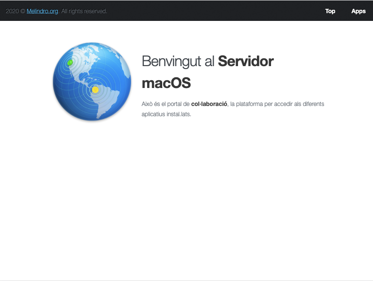
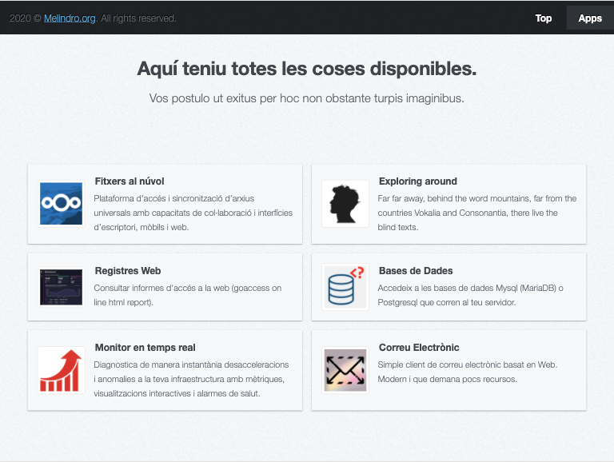

# Nginx multilingual Default home page replacement

According to my current nginx installation on macOSX I've build default home page.

## Features

* **Multilingual**. Same map concept of error pages, map languages to select proper language presentation (catalan, spanish, portuguese, ...). I've used same map for multilingual functionality that [Nginx Error Pages](https://github.com/cuquet/Nginx-error-pages)
* Fully responsive templates. Build with sass, include breakpoints **to work across desktop, tablet and mobile** phones.
* **Cards for main applications access** for example goaccess, rainloop, ... a jquery script controls target presence to activate specific card through server headers.
* **sass** theme compiled.
* **CSS3** preloader.

## Preview
Top element iPad in catalan


Application cards on iPad in catalan



## Installation
Requires additional request hearders in your webserver, in my case nginx. Add to nginx configuration as much add_header as cards needed. For example: 
		`add_header WEBAPP goaccess;`
First, you need to copy all the files contained within the `/html/` folder to a location on your default server. Second, you need to edit your `nginx.conf` or `modular.conf` files to enable your headers and activate card service.

### Copying the Pages
For this example we will assume that your Nginx default `www` folder is installed under `/usr/local/var/www/`. 

```bash
$ cd "default macOS server/"
$ cp -R html/ /usr/local/var/www/html
$ sudo chown -R _www:_www /usr/local/var/www/html # see note below.
```
**Note: _Ensure that you replace `_www` in the `chown` command above, with your web-server's default user and group. This example is for Nginx under macos_**

### Modify Nginx config files
Open the file with your favourite editor.

```bash
$ sudo nano /usr/local/etc/nginx/nginx.conf
```
Scroll down until you find the `http` section in your conf file. First we must include the language map

```nginx
http {
	[...]
		# Language detection from header "Accept-Language"
		map $http_accept_language $lang {
		    default      en;
		    ~*^it        it;
		    ~*^pt        pt;
		    ~*^ca        ca;
		    ~*^es        es;
		    ~*^fr        fr;
		    ~*^de        de;
		    ~*(^en|,en)  en;

		    ~*,it        it;
		    ~*,pt        pt;
		    ~*,ca        ca;
		    ~*,es        es;
		    ~*,fr        fr;
		    ~*,de        de;
		}
	[...]
}
```
Into `server` section which could be under same file or loaded through `sites-enabled` folder with links:

```nginx
server { 
	[...]

		location = /index.html {
                try_files /index.$lang.html /index.en.html;
        }
	[...]
        # GOACCESS
        add_header WEBAPP goaccess;
        location ^~/report.html {
                auth_basic "Authentication Required";
                auth_basic_user_file goaccess.users;
        }
	[...]
}
```
In this example I load online [goaccess](https://goaccess.io/) report with basic authentication and I enable goaccess card on default home page.

### Predefinied cards
* [Nextcloud](https://nextcloud.com/)
* [Goaccess](https://goaccess.io/)
* [Adminer](https://www.adminer.org/)
* [Netdata](https://www.netdata.cloud/)
* [Rainloop](https://www.rainloop.net/)
* [phpLDAPadmin](http://phpldapadmin.sourceforge.net/wiki/index.php/Main_Page)

#### Card structure

On .html files (each language)
```html
	<div id="NGINXHEADER" class="card">
		<div class="card-image">
			<a href="LINKSERVICE">
				
			</a>
		</div>
		<div class="card-body">
			<h4 class="card-title">TITLE</h4>
			<p class="card-text">DESCRIPTION</p>
		</div>
	</div>
```
Where:
Text           |Description    
 ------------- | -------------
NGINXHEADER    |Same word added on nginx config
LINKSERVICE    |href of the service linked
SERVICEIMAGE   |image to be added on `image/` folder. Size recomende 120px x 120px
TITLE          |Must be translated. Service name
DESCRIPTION    |Must be translated. Short description of the service

